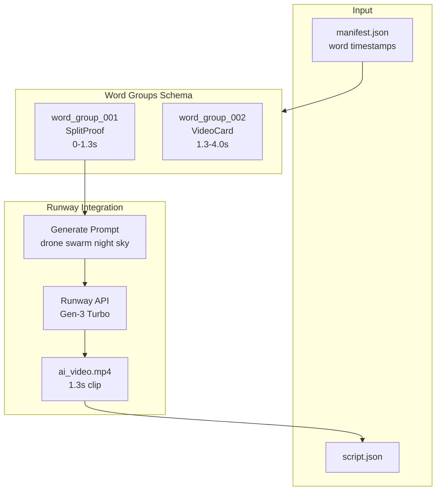

# AI Video with Word Groups Implementation

## Current State

- **Scene structure**: Single template per scene in [script.json](projects/first-draft/script/script.json)
- **Word timestamps**: Available in [manifest.json](projects/first-draft/voiceover/manifest.json) with precise timing
- **Target segment**: "This video from China" (0-1.3s) needs SplitProof with AI drone swarm video
- **No Runway integration** exists in the codebase

## Architecture



## Schema Extension: word_groups

Add to [schema.json](remotion-templates/schema.json):

```json
"word_groups": {
  "type": "array",
  "items": {
    "type": "object",
    "properties": {
      "id": { "type": "string" },
      "template": { "type": "string" },
      "word_range": { "start_index": 0, "end_index": 3 },
      "start_seconds": { "type": "number" },
      "end_seconds": { "type": "number" },
      "background": { "$ref": "#/definitions/background" },
      "avatar": { "$ref": "#/definitions/avatar" }
    }
  }
}
```

## Updated script.json Structure

```json
{
  "id": "scene_001",
  "template": "composite",
  "start_seconds": 0,
  "end_seconds": 4.0,
  "word_groups": [
    {
      "id": "wg_001",
      "template": "SplitProof",
      "word_range": { "start": 0, "end": 3 },
      "start_seconds": 0,
      "end_seconds": 1.3,
      "background": {
        "type": "ai_video",
        "src": "backgrounds/drone_swarm_ai.mp4",
        "prompt": "Drone swarm forming patterns in night sky..."
      },
      "avatar": { "visible": true, "position": "bottom" }
    },
    {
      "id": "wg_002", 
      "template": "VideoCard",
      "word_range": { "start": 4, "end": 15 },
      "start_seconds": 1.3,
      "end_seconds": 4.0,
      "background": { "type": "solid", "color": "#000000" }
    }
  ]
}
```

## Runway API Integration

Create MCP server or Python module for Runway:

- **Endpoint**: `POST https://api.runwayml.com/v1/video/generate`
- **Model**: Gen-3 Alpha Turbo (fast, 5s default)
- **Prompt engineering**: Based on word content + context

**Prompt for "This video from China"**:

> Cinematic drone swarm display over night sky. Thousands of glowing drones form intricate geometric patterns. Chinese aesthetic, futuristic, awe-inspiring. Camera slowly pans up. 4K quality.

**Duration handling**: Runway generates 5-10s videos, we'll trim to 1.3s in Remotion.

## Files to Create/Modify

| File | Action | Purpose |

|------|--------|---------|

| `remotion-templates/schema.json` | Modify | Add word_groups definition |

| `src/runway/generator.py` | Create | Runway API integration |

| `src/runway/__init__.py` | Create | Module init |

| `projects/first-draft/script/script.json` | Modify | Use word_groups structure |

| `remotion/src/templates/CompositeScene.tsx` | Create | Render word_groups |

## Runway API Setup

Requires `RUNWAY_API_KEY` environment variable. API call pattern:

```python
# src/runway/generator.py
async def generate_video(prompt: str, duration: int = 5) -> str:
    """Generate AI video and return path to downloaded file."""
    response = await client.post("/video/generate", {
        "prompt": prompt,
        "model": "gen3a_turbo",
        "duration": duration
    })
    # Poll for completion, download, return local path
```

## Validation Checklist

- Word group timestamps align with manifest.json
- Total duration under 4 seconds
- AI video matches "This video from China" context
- SplitProof template renders correctly with video background
- Smooth transition between word_groups