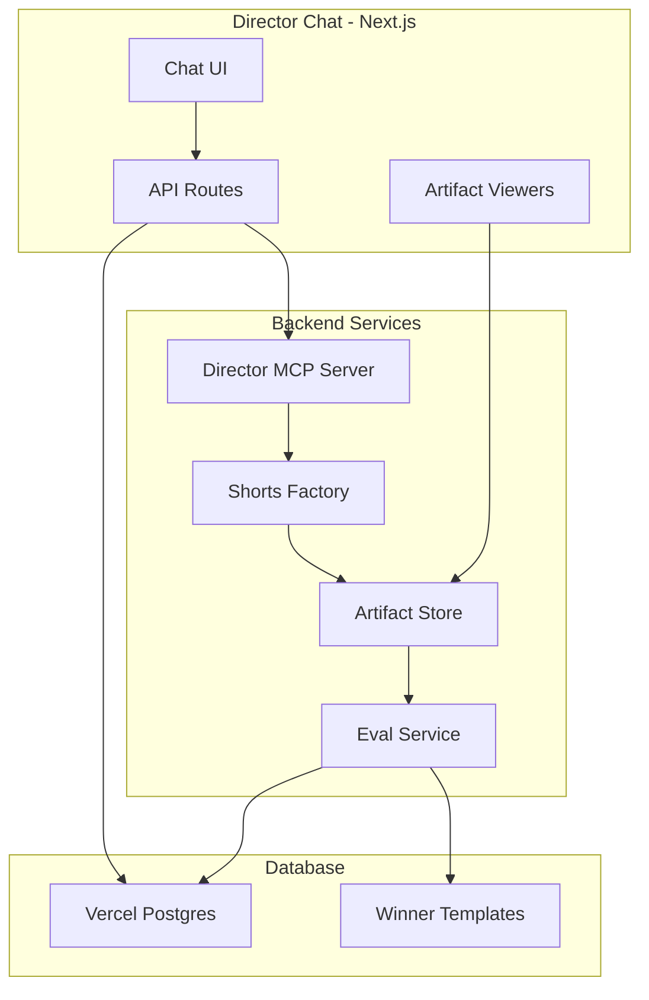
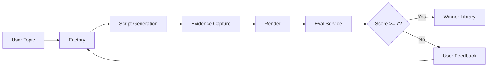

# Director Chat - Shorts Factory UI

## Architecture



## Pipeline Flow



## 1. Clone and Configure Vercel AI Chatbot

Fork vercel/ai-chatbot into `director-chat/`:

```bash
cd video_explainer
npx create-next-app director-chat --example https://github.com/vercel/ai-chatbot
```

Key files to customize:

- `app/api/chat/route.ts` - Add director-mcp tools
- `lib/ai/provider.ts` - Configure Anthropic (Claude)
- `artifacts/` - Custom artifact components

## 2. Director MCP Integration

### Option A: HTTP Integration (Recommended)

Run director-mcp as a sidecar service, call via HTTP from API routes:

```typescript
// director-chat/lib/director-client.ts
export async function callDirectorTool(tool: string, params: Record<string, any>) {
  const res = await fetch(`${process.env.DIRECTOR_MCP_URL}/tools/${tool}`, {
    method: 'POST',
    body: JSON.stringify(params),
  });
  return res.json();
}
```

### Option B: AI SDK Tool Integration

Define tools that wrap director-mcp calls:

```typescript
// director-chat/lib/ai/tools.ts
import { tool } from 'ai';
import { z } from 'zod';

export const directorTools = {
  createProject: tool({
    description: 'Create a new shorts factory project',
    parameters: z.object({
      topic: z.string(),
      duration: z.number().default(45),
    }),
    execute: async ({ topic, duration }) => {
      // Call director-mcp factory_create_project
    },
  }),
  
  approveStage: tool({
    description: 'Approve a pipeline stage',
    parameters: z.object({
      projectId: z.string(),
      gate: z.enum(['script', 'evidence', 'screenshots', 'render']),
    }),
    execute: async ({ projectId, gate }) => {
      // Call director-mcp factory_approve_stage
    },
  }),
};
```

## 3. Custom Artifact Components

Create artifact viewers for the Shorts Factory outputs:

### Script Viewer

```typescript
// director-chat/artifacts/script-viewer.tsx
export function ScriptViewer({ script }: { script: Script }) {
  return (
    <div className="space-y-4">
      {script.scenes.map(scene => (
        <SceneCard key={scene.scene_id} scene={scene} />
      ))}
    </div>
  );
}
```

### Screenshot Gallery

```typescript
// director-chat/artifacts/screenshot-gallery.tsx
export function ScreenshotGallery({ artifacts }: Props) {
  // Grid of screenshots with approve/reject buttons
}
```

### Approval Panel

```typescript
// director-chat/artifacts/approval-panel.tsx
export function ApprovalPanel({ gate, onApprove, onReject }: Props) {
  // Gate status, approve/reject buttons, feedback input
}
```

### Video Preview

```typescript
// director-chat/artifacts/video-preview.tsx
export function VideoPreview({ manifest }: Props) {
  // Remotion preview or rendered video player
}
```

## 4. Database Schema (Vercel Postgres)

Extend the default schema with template ratings:

```sql
-- director-chat/lib/db/schema.ts (Drizzle)
export const templates = pgTable('templates', {
  id: text('id').primaryKey(),
  topic: text('topic').notNull(),
  scriptJson: jsonb('script_json').notNull(),
  createdAt: timestamp('created_at').defaultNow(),
  userId: text('user_id').references(() => users.id),
});

export const templateRatings = pgTable('template_ratings', {
  id: text('id').primaryKey(),
  templateId: text('template_id').references(() => templates.id),
  userId: text('user_id').references(() => users.id),
  rating: integer('rating').notNull(), // 1 = downvote, 5 = upvote
  feedback: text('feedback'),
  createdAt: timestamp('created_at').defaultNow(),
});
```

## 5. Eval/Scoring Service

The Eval Service runs after Factory completion to auto-score templates and pick winners.

### Scoring Dimensions

| Dimension | Weight | Source |

|-----------|--------|--------|

| Hook Score | 25% | `director_analyze_hook` |

| Retention Score | 25% | `director_validate_retention` |

| Pacing Score | 20% | `director_generate_beats` |

| Evidence Quality | 15% | Screenshot resolution, relevance |

| User Rating | 15% | Upvote/downvote history |

### Eval Service Implementation

```python
# src/eval/scorer.py
class TemplateScorer:
    """
    Scores completed templates to identify winners.
    Winners are stored in the template library for RAG retrieval.
    """
    
    WINNER_THRESHOLD = 7.0  # Score >= 7 becomes a winner
    
    async def score_template(self, project_id: str) -> TemplateScore:
        # 1. Get completed artifacts from store
        script = self.store.get_locked_script()
        
        # 2. Run analysis tools
        hook_analysis = await analyze_hook(script)
        retention = await validate_retention(script)
        beats = await generate_beat_sheet(script)
        
        # 3. Calculate weighted score
        score = (
            hook_analysis.hook_score * 0.25 +
            retention.retention_score * 0.25 +
            beats.pacing_score * 0.20 +
            self._score_evidence(project_id) * 0.15 +
            self._get_user_rating(project_id) * 0.15
        )
        
        # 4. Store score and check for winner
        if score >= self.WINNER_THRESHOLD:
            self._add_to_winner_library(project_id, score)
        
        return TemplateScore(
            project_id=project_id,
            overall_score=score,
            breakdown={...},
            is_winner=score >= self.WINNER_THRESHOLD,
        )
```

### Winner Library (RAG)

Winners are embedded and stored for retrieval when generating new templates:

```python
# src/eval/winner_library.py
class WinnerLibrary:
    """
    Stores winning templates with embeddings for RAG retrieval.
    Used to improve future script generation.
    """
    
    async def add_winner(self, project_id: str, score: float):
        script = self.store.get_locked_script()
        
        # Generate embedding from script content
        embedding = await self.embed(
            f"{script.topic}\n{script.voiceover_text}"
        )
        
        # Store in Postgres with pgvector
        await self.db.execute(
            """
            INSERT INTO winner_templates (id, topic, script_json, embedding, score)
            VALUES ($1, $2, $3, $4, $5)
            """,
            project_id, script.topic, script.to_json(), embedding, score
        )
    
    async def get_similar_winners(self, topic: str, limit: int = 3):
        """Retrieve similar winning templates for few-shot prompting."""
        embedding = await self.embed(topic)
        
        return await self.db.fetch(
            """
            SELECT topic, script_json, score
            FROM winner_templates
            ORDER BY embedding <-> $1
            LIMIT $2
            """,
            embedding, limit
        )
```

### Database Schema for Eval

```sql
-- Add to director-chat/lib/db/schema.ts
export const templateScores = pgTable('template_scores', {
  id: text('id').primaryKey(),
  projectId: text('project_id').notNull(),
  overallScore: real('overall_score').notNull(),
  hookScore: real('hook_score'),
  retentionScore: real('retention_score'),
  pacingScore: real('pacing_score'),
  evidenceScore: real('evidence_score'),
  userRating: real('user_rating'),
  isWinner: boolean('is_winner').default(false),
  createdAt: timestamp('created_at').defaultNow(),
});

export const winnerTemplates = pgTable('winner_templates', {
  id: text('id').primaryKey(),
  topic: text('topic').notNull(),
  scriptJson: jsonb('script_json').notNull(),
  embedding: vector('embedding', { dimensions: 1536 }), // pgvector
  score: real('score').notNull(),
  usageCount: integer('usage_count').default(0),
  createdAt: timestamp('created_at').defaultNow(),
});
```

### MCP Tools for Eval

Add to director-mcp:

```python
@mcp.tool(name="eval_score_template")
async def eval_score_template(params: ScoreTemplateInput) -> str:
    """Score a completed template and determine if it's a winner."""
    scorer = TemplateScorer(store)
    score = await scorer.score_template(params.project_id)
    return json.dumps(score.to_dict())

@mcp.tool(name="eval_get_similar_winners")
async def eval_get_similar_winners(params: GetWinnersInput) -> str:
    """Get similar winning templates for few-shot prompting."""
    library = WinnerLibrary(store, db)
    winners = await library.get_similar_winners(params.topic, params.limit)
    return json.dumps([w.to_dict() for w in winners])
```

## 6. Chat Flow for Shorts Creation

### System Prompt

```
You are the Director Chat assistant for the Shorts Factory.
You help users create high-quality Varun Mayya-style short-form videos.

When users describe a topic:
1. Search for similar winning templates (RAG)
2. Create a project using factory_create_project
3. Show the generated script artifact
4. Wait for user approval/feedback
5. Continue through evidence, screenshots, and render stages
6. Auto-score the completed template
7. If score >= 7, add to winner library
8. Ask for user rating (upvote/downvote) to refine scoring
```

### Example Interaction

```

User: "Create a short about DeepSeek's pricing crash"