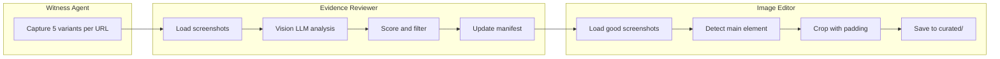

# Evidence Curation Pipeline

## Architecture Overview



## Existing Code to Leverage

- **Vision LLM**: Use `src/understanding/llm_provider.py` pattern with Claude's vision API (base64 images)
- **Witness Output**: `visual-truth-engine/schemas/assets.py` defines `ScreenshotBundle` with 5 variants
- **Manifest Format**: From `CLAUDE.md` - captures array with files object
- **Crop Schema**: `remotion/src/templates/types.ts` has `crop` and `highlight_box` types

---

## Agent 1: Evidence Reviewer

**Location**: `src/evidence/reviewer.py`

### Input

- `projects/{id}/evidence/` folder with raw screenshots from Witness
- Each evidence has 5 variants: `element_padded`, `element_tight`, `context`, `viewport`, `fullpage`

### Processing

1. Load all screenshot files from evidence folder
2. For each screenshot, call vision LLM to evaluate:

   - **Blank detection**: Is the image mostly empty/white/black?
   - **Relevance**: Does it contain the expected content (from anchor_text)?
   - **Readability**: Is text clearly visible and readable?
   - **Composition**: Is the key element well-framed?

3. Score each variant (0-10) with reasons
4. Mark variants as `keep` or `reject`

### Output

- Updated `manifest.json` with review results:
```json
{
  "captures": [{
    "id": "techspot_001",
    "url": "...",
    "anchor_text": "...",
    "files": {
      "element_padded": "techspot_001_element_padded.png",
      "element_tight": "techspot_001_element_tight.png",
      "context": "techspot_001_context.png",
      "viewport": "techspot_001_viewport.png",
      "fullpage": "techspot_001_fullpage.png"
    },
    "review": {
      "element_padded": {"score": 8, "keep": true, "reason": "Clear headline, good framing"},
      "element_tight": {"score": 6, "keep": true, "reason": "Tight but readable"},
      "context": {"score": 3, "keep": false, "reason": "Too much clutter"},
      "viewport": {"score": 2, "keep": false, "reason": "Mostly blank"},
      "fullpage": {"score": 4, "keep": false, "reason": "Text too small"}
    },
    "best_variant": "element_padded"
  }]
}
```


---

## Agent 2: Image Editor

**Location**: `src/evidence/editor.py`

### Input

- `manifest.json` with review results
- Raw screenshots in `evidence/` folder

### Processing

1. For each capture with `keep: true` variants:
2. Load the best variant (or all kept variants)
3. Use vision LLM to detect the main content area:

   - Find bounding box of headline/article/key element
   - Determine optimal crop region with padding

4. Crop image using PIL/Pillow
5. Optionally resize to standard dimensions

### Output

- `curated/` folder with processed images:
```
projects/{id}/evidence/
├── manifest.json           # Updated with crop coordinates
├── techspot_001_element_padded.png  # Raw
├── techspot_001_element_tight.png   # Raw
└── curated/
    ├── techspot_001.png    # Best cropped version
    └── techspot_001_crop.json  # Crop metadata
```

- Manifest updated with crop info:
```json
{
  "captures": [{
    "id": "techspot_001",
    "curated": {
      "file": "curated/techspot_001.png",
      "source_variant": "element_padded",
      "crop": {"x": 20, "y": 50, "width": 800, "height": 400}
    }
  }]
}
```


---

## Implementation Details

### Vision LLM Integration

Create `src/evidence/vision.py` for image analysis:

```python
# Use anthropic SDK with base64 image encoding
def analyze_screenshot(image_path: Path, anchor_text: str) -> dict:
    with open(image_path, "rb") as f:
        image_data = base64.b64encode(f.read()).decode()
    
    response = client.messages.create(
        model="claude-sonnet-4-20250514",
        messages=[{
            "role": "user",
            "content": [
                {"type": "image", "source": {"type": "base64", "data": image_data}},
                {"type": "text", "text": f"Analyze this screenshot..."}
            ]
        }]
    )
```

### Image Cropping

Use PIL/Pillow (already in codebase via `visual-truth-engine`):

```python
from PIL import Image

def crop_image(image_path: Path, crop: dict, output_path: Path):
    img = Image.open(image_path)
    cropped = img.crop((crop["x"], crop["y"], 
                        crop["x"] + crop["width"], 
                        crop["y"] + crop["height"]))
    cropped.save(output_path)
```

---

## CLI Commands

Add to `src/cli/main.py`:

```bash
# Review evidence screenshots
video-explainer evidence review --project template-test

# Crop/curate reviewed evidence  
video-explainer evidence curate --project template-test

# Do both in sequence
video-explainer evidence process --project template-test
```

---

## File Structure

```
src/evidence/
├── __init__.py
├── reviewer.py      # Evidence Reviewer agent
├── editor.py        # Image Editor agent
├── vision.py        # Vision LLM helpers
└── models.py        # Pydantic models for review/crop data
```

---

## Later: Highlighter Agent

After the Director writes `script.json`, the Highlighter will:

1. Read script to find what text to highlight per scene
2. Use vision LLM to locate text coordinates in curated screenshots
3. Generate highlight overlay or coordinates for Remotion templates
4. Update manifest with highlight_box info