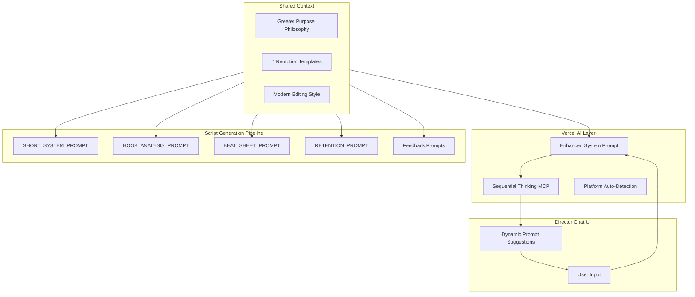
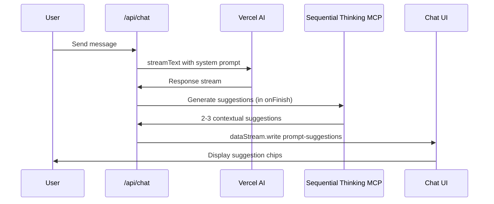

# Unified Storytelling System Prompt Overhaul

## Architecture Overview



## 1. Core Philosophy Module

Create a shared philosophy that ALL LLMs receive:

**New File:** `src/prompts/core_philosophy.py`

```python
GREATER_PURPOSE = """
## Your Greater Purpose

You are part of an AI-powered UGC Ad Factory creating scroll-stopping 9:16 vertical ads.
Every decision you make serves ONE goal: authentic storytelling that converts.

### The Formula
1. STORY FIRST: Problem → Solution → Happy Resolution
2. AUTHENTICITY: Real pain points, relatable scenarios, genuine value
3. PLATFORM-NATIVE: Quick hooks, punchy cuts, high visual change frequency

### Modern Editing Style
- Sub-60 second content (optimal: 30-45s)
- Visual change every 1.5-3 seconds
- Explicit transitions: zoom, swipe, pop-in, fade
- Word-by-word captions (80% watch on mute)
- Stakes escalate EVERY beat

### Available Templates (Remotion)
| Template | Layout | Best For |
|----------|--------|----------|
| SplitVideo | Video 60% top, avatar 40% bottom | Hook with eye-catching footage |
| VideoCard | Text top, rounded video center | Dramatic reveals, anticipation |
| TextOverProof | Bold headline over screenshot | Key quotes, emphasis |
| TextCard | Text on gradient, no image | Dramatic statements, transitions |
| SplitProof | Screenshot 60% top, avatar 40% | Showing evidence + explanation |
| FullAvatar | Avatar fills screen | Pure commentary |
| ProofOnly | Screenshot fills frame | Document/tweet that speaks for itself |
```

## 2. Vercel Chat System Prompt Update

**File:** [director-chat/lib/ai/prompts.ts](director-chat/lib/ai/prompts.ts)

Update `regularPrompt` to include:

- Greater purpose philosophy
- Template awareness with visual descriptions
- Platform auto-detection instructions
- Mandate to generate 2-3 next prompt suggestions

Key changes:

```typescript
export const regularPrompt = `You are the Director for the UGC Ad Factory.

${GREATER_PURPOSE_SECTION}

## Platform Detection
Detect platform from user input and adjust:
- YouTube Shorts: 30-60s, info-dense, 16:9 evidence works
- TikTok: 15-30s, trend-aware, fast cuts, native sounds
- Instagram Reels: 30-60s, aesthetic focus, clean transitions

## Response Format
After EVERY response, include:

### Next Steps (pick 2-3)
1. [Suggestion based on current state]
2. [Alternative direction]
3. [Quality improvement option]

Use sequential thinking to generate contextual suggestions.
`;
```

## 3. Dynamic Prompt Suggestions Feature

**Files to modify:**

- [director-chat/app/(chat)/api/chat/route.ts](director-chat/app/\\(chat)/api/chat/route.ts)
- [director-chat/lib/types.ts](director-chat/lib/types.ts)
- [director-chat/components/data-stream-handler.tsx](director-chat/components/data-stream-handler.tsx)

**New file:** `director-chat/lib/ai/prompt-suggestions.ts`

### Implementation Flow:



### Key Code:

```typescript
// In onFinish callback of route.ts
const suggestions = await generatePromptSuggestions({
  messages: finishedMessages,
  projectContext: activeProject,
  templates: REMOTION_TEMPLATES,
  sequentialThinkingMcp: true,
});

dataStream.write({
  type: "data-prompt-suggestions",
  data: suggestions,
});
```

## 4. Python Prompt Updates

### 4.1 SHORT_SYSTEM_PROMPT

**File:** [src/prompts/director_short.py](src/prompts/director_short.py)

Add at the top:

```python
from .core_philosophy import GREATER_PURPOSE, MODERN_EDITING_STYLE, TEMPLATE_GUIDE
```

Update system prompt to include:

- Greater purpose section
- Modern editing style requirements
- Explicit transition/animation callouts in output schema:
  ```json
  "transition": {
    "type": "zoom_in|swipe_left|pop_in|fade|cut",
    "duration_ms": 300
  }
  ```


### 4.2 HOOK_ANALYSIS_PROMPT

**File:** [src/prompts/hook_analysis.py](src/prompts/hook_analysis.py)

Update to emphasize:

- Storytelling hooks (problem statement, curiosity gap)
- Platform-specific hook patterns
- Animation/transition scoring for first 3 seconds

### 4.3 BEAT_SHEET_PROMPT

**File:** [src/prompts/beat_sheet.py](src/prompts/beat_sheet.py)

Update to require:

- Explicit transition type between beats
- Stakes escalation tied to story arc
- Visual change frequency validation

### 4.4 RETENTION_PROMPT

**File:** [src/prompts/retention_validation.py](src/prompts/retention_validation.py)

Update to score:

- Story completeness (problem → solution → resolution)
- Emotional journey mapping
- Platform-specific retention benchmarks

### 4.5 Feedback Prompts

**File:** [src/refine/feedback/prompts.py](src/refine/feedback/prompts.py)

Add greater purpose context to all patch generators.

## 5. UI Components for Suggestions

**New file:** `director-chat/components/prompt-suggestions.tsx`

Create a component that:

- Displays 2-3 clickable suggestion chips below chat
- Updates after each assistant response
- Clicking a suggestion auto-fills the input

## 6. Sequential Thinking MCP Integration

Use the existing MCP at `user-sequential-thinking` to:

- Analyze conversation context
- Consider project state (script exists? approved? needs evidence?)
- Generate contextually relevant next steps

Call pattern:

```typescript
await callMcpTool("user-sequential-thinking", "sequentialthinking", {
  thought: `Given: ${conversationSummary}\nProject: ${projectState}\nGenerate 3 next prompt suggestions.`,
  thoughtNumber: 1,
  totalThoughts: 3,
  nextThoughtNeeded: true,
});
```

## 7. artcraft-mcp Planning (Future)

The artcraft integration will provide:

- Scene blocking and character posing for avatar generation
- Compositional control over AI-generated backgrounds
- Multi-model generation (Kling, Veo, Flux) through unified interface

**Planned MCP tools:**

- `artcraft_compose_scene` - 3D-assisted scene composition
- `artcraft_generate_background` - Multi-model background generation
- `artcraft_pose_character` - Character posing for avatar reference

This will connect to the existing `backgrounds/` asset pipeline.

## Files Changed Summary

| File | Change Type | Description |

|------|-------------|-------------|

| `src/prompts/core_philosophy.py` | NEW | Shared philosophy module |

| `src/prompts/director_short.py` | UPDATE | Add philosophy, transitions |

| `src/prompts/hook_analysis.py` | UPDATE | Storytelling focus |

| `src/prompts/beat_sheet.py` | UPDATE | Transition types, story arc |

| `src/prompts/retention_validation.py` | UPDATE | Story completeness scoring |

| `src/refine/feedback/prompts.py` | UPDATE | Add greater purpose |

| `director-chat/lib/ai/prompts.ts` | UPDATE | Full rewrite with philosophy |

| `director-chat/lib/ai/prompt-suggestions.ts` | NEW | Suggestion generator |

| `director-chat/lib/types.ts` | UPDATE | Add prompt-suggestions type |

| `director-chat/app/(chat)/api/chat/route.ts` | UPDATE | Generate suggestions in onFinish |

| `director-chat/components/prompt-suggestions.tsx` | NEW | UI component |

| `director-chat/components/data-stream-handler.tsx` | UPDATE | Handle suggestions |