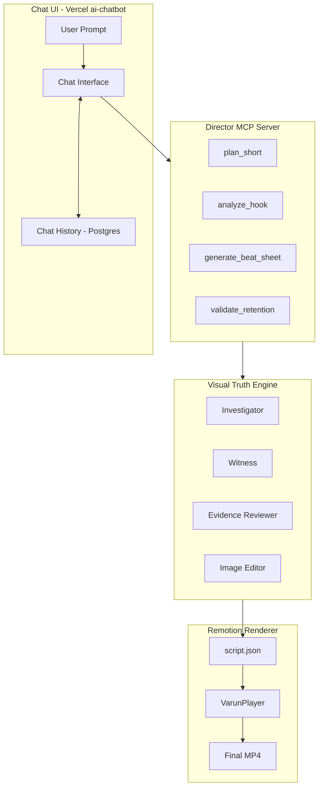
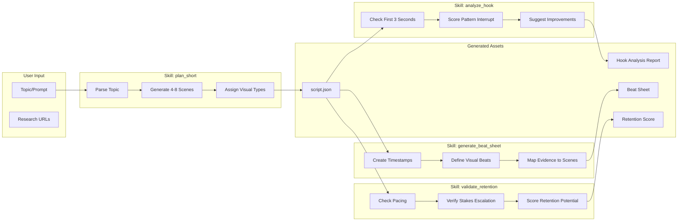

# Director MCP + Chat UI Planning Document

## Overview

This document outlines the architecture for a **Varun Mayya-style Director MCP** with a chat interface. The system enables users to:
1. Input prompts via a chat UI
2. Have the Director plan scenes with visual storytelling skills
3. Orchestrate the full video production pipeline

---

## Architecture Diagram 1: System Overview



---

## Architecture Diagram 2: Director MCP Skills Flow



---

## Four Director Skills (Varun Mayya Style)

### Skill 1: `plan_short` - Ultra-Tight Visual Storytelling

**Purpose**: Transform any topic into a 15-60 second script with proof beats.

**Input**:
```json
{
  "topic": "DeepSeek's pricing is crashing the AI market",
  "style": "varun_mayya",
  "duration_seconds": 45,
  "evidence_urls": ["https://deepseek.com/pricing", "https://twitter.com/..."]
}
```

**Output**: `script.json` with scenes following Hook → Evidence → Analysis → CTA pattern.

**Rules**:
- Max 20 words per voiceover
- Every claim needs `needs_evidence: true`
- Alternate between avatar and proof shots
- Visual types: `static_highlight`, `scroll_highlight`, `dom_crop`, `full_avatar`

---

### Skill 2: `analyze_hook` - Hook & Loop Instincts

**Purpose**: Evaluate and improve the first 3 seconds of a script.

**Input**:
```json
{
  "script_path": "projects/xyz/script/script.json",
  "scene_id": 1
}
```

**Output**:
```json
{
  "hook_score": 7,
  "pattern_interrupt": "weak",
  "suggestions": [
    "Add movement in first frame",
    "Make claim more specific: '14 cents' not 'cheap'",
    "Start with question or bold statement"
  ],
  "improved_hook": "OpenAI is charging you 30x more than they should."
}
```

**Rules**:
- Check for scroll-stopping opener
- Verify outcome-focused language
- Ensure visual matches hook energy

---

### Skill 3: `generate_beat_sheet` - Stakes-Rising Structure

**Purpose**: Break a script into 5-7 second visual beats with escalating stakes.

**Input**:
```json
{
  "script_path": "projects/xyz/script/script.json"
}
```

**Output**:
```json
{
  "beats": [
    {"time": "0-3s", "type": "hook", "stakes": "attention", "visual": "avatar_bold_claim"},
    {"time": "3-8s", "type": "setup", "stakes": "context", "visual": "evidence_screenshot"},
    {"time": "8-15s", "type": "proof1", "stakes": "credibility", "visual": "dom_crop_pricing"},
    {"time": "15-22s", "type": "proof2", "stakes": "escalation", "visual": "scroll_twitter"},
    {"time": "22-28s", "type": "implication", "stakes": "consequence", "visual": "avatar_reaction"},
    {"time": "28-32s", "type": "cta", "stakes": "action", "visual": "avatar_close"}
  ],
  "total_stakes_curve": "ascending"
}
```

**Rules**:
- Each beat must raise stakes from previous
- New information every 5-7 seconds
- Visual change at each beat boundary
- No "dead air" or filler

---

### Skill 4: `validate_retention` - Retention Engineering

**Purpose**: Score a script's retention potential and flag drop-off risks.

**Input**:
```json
{
  "script_path": "projects/xyz/script/script.json"
}
```

**Output**:
```json
{
  "retention_score": 8.2,
  "predicted_avg_view_pct": 72,
  "drop_off_risks": [
    {"time": "12s", "reason": "No visual change for 5 seconds", "severity": "high"},
    {"time": "25s", "reason": "Weak transition to CTA", "severity": "medium"}
  ],
  "recommendations": [
    "Add pattern interrupt at 12s (text pop, zoom, or cut)",
    "Strengthen CTA with specific outcome"
  ],
  "benchmark": "Top 10% retention for tech/AI shorts"
}
```

**Rules**:
- Check visual change frequency (target: every 2-4 seconds)
- Verify stakes escalation (never plateau)
- Flag long avatar-only segments
- Check CTA strength

---

## Clarifying Questions

Before implementation, please clarify:

### 1. Chat UI Deployment
- [ ] Should we fork vercel/ai-chatbot or build minimal custom UI?
- [ ] Deploy to Vercel or self-host?
- [ ] Auth required? (GitHub OAuth, email, or public?)

### 2. MCP Transport
- [ ] stdio (local CLI use) or streamable HTTP (remote web UI)?
- [ ] If HTTP, what port? Behind Vercel proxy?

### 3. LLM Backend
- [ ] Use OpenAI (GPT-4o) like existing Director, or switch to Claude?
- [ ] Should MCP tools call LLMs directly or delegate to existing agents?

### 4. Integration Depth
- [ ] Should `plan_short` automatically trigger Witness capture?
- [ ] Or return script.json for manual pipeline execution?

### 5. Evidence Sources
- [ ] Auto-search via Exa.ai (Investigator), or user-provided URLs only?
- [ ] Support for manual screenshot upload?

---

## File Structure (Created)

```
video_explainer/
├── director-mcp/                    # CREATED: Director MCP Server
│   ├── src/
│   │   ├── __init__.py
│   │   ├── server.py               # FastMCP server with 4 tools
│   │   ├── models.py               # Pydantic schemas (20+ models)
│   │   └── skills/
│   │       ├── __init__.py
│   │       ├── plan_short.py       # Skill 1: Ultra-tight storytelling
│   │       ├── analyze_hook.py     # Skill 2: Hook analysis
│   │       ├── generate_beats.py   # Skill 3: Beat sheet generation
│   │       └── validate_retention.py # Skill 4: Retention scoring
│   ├── requirements.txt
│   └── README.md
│
├── director-chat/                   # TODO: Chat UI (vercel/ai-chatbot fork)
│   ├── app/
│   ├── components/
│   ├── lib/
│   │   └── mcp-client.ts           # MCP client integration
│   ├── package.json
│   └── vercel.json
│
├── visual-truth-engine/             # Existing
│   └── agents/
│       ├── director.py             # Existing (wrapped by MCP skills)
│       ├── investigator.py
│       └── witness.py
│
└── src/evidence/                    # Existing (Reviewer + Editor)
```

---

## Implementation Order

1. **Phase 1**: Create `director-mcp/` with 4 skills (Python/FastMCP)
2. **Phase 2**: Test MCP with MCP Inspector
3. **Phase 3**: Fork vercel/ai-chatbot → `director-chat/`
4. **Phase 4**: Integrate MCP client into chat UI
5. **Phase 5**: Deploy to Vercel with MCP server

---

## Next Steps

Once you answer the clarifying questions above, I will:

1. Create `director-mcp/src/server.py` with all 4 skills
2. Wire it to existing `visual-truth-engine/agents/director.py`
3. Fork and customize vercel/ai-chatbot
4. Connect everything with proper MCP client integration

**Ready to proceed?**
